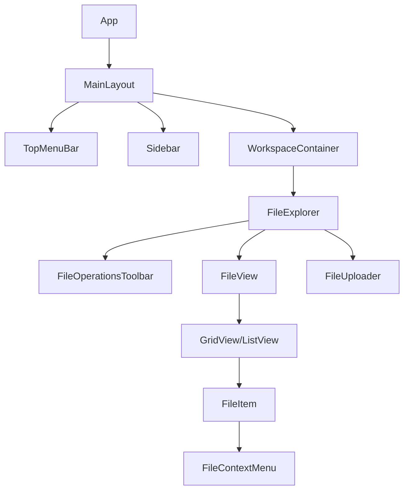
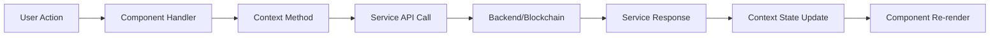

# AptosFS Component Architecture Guide

This guide provides a comprehensive overview of the AptosFS component architecture, including key relationships, data flow patterns, and design decisions.

## Table of Contents

- [System Overview](#system-overview)
- [Core Components](#core-components)
- [Component Hierarchy](#component-hierarchy)
- [Data Flow](#data-flow)
- [Key Design Patterns](#key-design-patterns)
- [Extension Points](#extension-points)

## System Overview

AptosFS is a decentralized file system frontend built with React and TypeScript. It provides a modern, intuitive interface for managing files stored on the Aptos blockchain and various storage providers.

The architecture follows these key principles:
- **Component-based structure**: UI is composed of reusable, modular components
- **Context-based state management**: Application state is managed through React Context API
- **Service-oriented integration**: Backend services are accessed through dedicated service layers
- **Progressive enhancement**: Core functionality works without JavaScript, enhanced with JS
- **Accessibility-first**: All components meet WCAG 2.1 AA standards



## Core Components

### FileExplorer

The central component that integrates file viewing and operations:

```typescript
// Component responsibilities:
// - Display current directory contents
// - Handle file selection
// - Manage file operations via context
// - Provide navigation capabilities
// - Coordinate between view components
```

**Key Properties**:
- Manages current directory state
- Handles file selection logic
- Coordinates file operations
- Provides view switching (grid/list)

**Key Methods**:
- `handleDoubleClick(item)`: Navigate into folders or open files
- `handleContextMenu(item, event)`: Show context menu for items
- `navigateUp()`: Navigate to parent directory
- `refreshCurrentDirectory()`: Reload current directory contents

### FileOperationsContext

The core state management context that handles file operations:

```typescript
// Context responsibilities:
// - File operation state management
// - Directory listing and navigation
// - File selection state
// - Clipboard operations
// - Undo/redo functionality
```

**Key Methods**:
- `uploadFiles(files, options)`: Upload files to current directory
- `downloadFile(file, options)`: Download specific file
- `createFolder(name, options)`: Create new folder
- `moveItems(items, destination)`: Move files/folders
- `copyItems(items, destination)`: Copy files/folders
- `deleteItems(items, toTrash)`: Delete or move to trash

### File Views (GridView/ListView)

Components responsible for displaying files in different formats:

```typescript
// View responsibilities:
// - Render file items in appropriate layout
// - Handle selection events
// - Support keyboard navigation
// - Virtual rendering for performance
```

**Key Properties**:
- `files`: Array of file items to display
- `selectedItems`: Currently selected items
- `onSelect`: Selection handler
- `onDoubleClick`: Navigation/open handler

## Component Hierarchy

AptosFS follows a hierarchical component structure:

1. **App**: Root component, provides auth and theme contexts
2. **MainLayout**: Primary layout with sidebar and workspace
3. **WorkspaceContainer**: Content area for file management
4. **FileExplorer**: Core file management component
5. **FileView**: Displays files (GridView or ListView)
6. **FileItem**: Individual file/folder representation
7. **FileOperationsToolbar**: Actions for file manipulation
8. **FileContextMenu**: Context menu for file operations

## Data Flow

AptosFS uses a unidirectional data flow pattern:

1. **User actions** (click, drag, keyboard) trigger component callbacks
2. **Component handlers** call methods from context providers
3. **Context providers** update internal state and call services
4. **Services** interact with backend APIs
5. **Context** propagates state changes to components
6. **Components** re-render with updated state



## Key Design Patterns

### Provider Pattern

Context providers supply application state to component tree:

```typescript
// FileOperationsProvider supplies file operations context
const FileExplorer = () => (
  <FileOperationsProvider>
    <FileExplorerContent />
  </FileOperationsProvider>
);
```

### Compound Components

Related components work together as a cohesive unit:

```typescript
// FileItem uses FileIcon as a specialized child component
<FileItem file={file}>
  <FileIcon type={file.type} />
  <FileItemDetails file={file} />
</FileItem>
```

### Render Props

For flexible component composition:

```typescript
// FileView can use custom render functions
<FileView
  files={files}
  renderItem={(file) => <CustomFileItem file={file} />}
/>
```

### Hooks for Logic Reuse

Custom hooks extract and share logic:

```typescript
// useVirtualizedList for efficient rendering
const { visibleItems, containerProps } = useVirtualizedList({
  items: files,
  itemHeight: 64,
  overscan: 5
});
```

## Extension Points

AptosFS is designed for extensibility in several key areas:

### Storage Providers

New storage backends can be implemented by creating a new provider:

```typescript
// Implement StorageProvider interface for new storage backends
class NewStorageProvider implements StorageProvider {
  uploadFile(file: File, path: string): Promise<FileUploadResult> {
    // Implementation
  }
  
  downloadFile(filePath: string): Promise<Blob> {
    // Implementation
  }
  
  // Other required methods
}
```

### File Type Handlers

Custom file type handlers can be registered for previews:

```typescript
// Register handler for custom file type
registerFileTypeHandler({
  type: 'custom-format',
  icon: CustomIcon,
  preview: CustomPreviewComponent,
  actions: [
    { name: 'customAction', handler: doCustomAction }
  ]
});
```

### UI Customization

Theme and UI can be customized through theme context:

```typescript
// Customize theme through ThemeProvider
<ThemeProvider 
  theme={{
    colors: { primary: '#3366FF' },
    spacing: { unit: 8 },
    // Additional theme customizations
  }}
>
  <App />
</ThemeProvider>