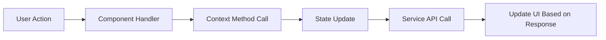

# AptosFS State Management Patterns

This document explains the state management approach used in AptosFS, focusing on how application state flows through the system and the patterns used to ensure predictable state updates.

## Table of Contents

- [Overview](#overview)
- [Context Providers](#context-providers)
- [State Flow Patterns](#state-flow-patterns)
- [Optimizing Re-renders](#optimizing-re-renders)
- [State Persistence](#state-persistence)
- [Error Handling](#error-handling)

## Overview

AptosFS uses React's Context API for state management, avoiding external state management libraries to reduce bundle size and dependencies. The application state is divided into several domain-specific contexts:

1. **FileOperationsContext**: Manages file system operations and state
2. **AuthContext**: Handles authentication state and user information
3. **ThemeContext**: Controls application theming and appearance preferences

Each context is responsible for its specific domain and exposes a well-defined API for components to interact with.

## Context Providers

### FileOperationsContext

The primary state container for file operations:

```typescript
// Core file operations state
const [currentDirectory, setCurrentDirectory] = useState('/');
const [selectedItems, setSelectedItems] = useState<FileItem[]>([]);
const [clipboard, setClipboard] = useState<ClipboardState>({
  operationType: null,
  items: [],
  sourceDirectory: ''
});
const [operations, setOperations] = useState<FileOperation[]>([]);
const [fileTemplates, setFileTemplates] = useState<FileTemplate[]>([]);
const [canUndo, setCanUndo] = useState(false);
const [canRedo, setCanRedo] = useState(false);
const [files, setFiles] = useState<FileItem[]>([]);
```

The context maintains state for:
- Current directory path
- Selected file items
- Clipboard operations (cut/copy)
- Active file operations (uploads, downloads, etc.)
- Available file templates
- Undo/redo capability
- Current directory contents

### AuthContext

Manages authentication state:

```typescript
// Auth state
type AuthState = {
  isAuthenticated: boolean;
  user: User | null;
  isLoading: boolean;
  error: string | null;
};

// Auth context methods
type AuthContextType = {
  authState: AuthState;
  login: (credentials: LoginCredentials) => Promise<void>;
  register: (userData: RegisterData) => Promise<void>;
  logout: () => Promise<void>;
  connectWallet: () => Promise<void>;
  disconnectWallet: () => Promise<void>;
};
```

## State Flow Patterns

AptosFS follows unidirectional data flow patterns:

### 1. State Update Pattern



### 2. Optimistic Updates

For better perceived performance, AptosFS uses optimistic updates:

```typescript
// Example: Renaming a file optimistically
const renameItem = async (item: FileItem, newName: string, options?: any): Promise<any> => {
  // 1. Create optimistic update
  const optimisticItem = { ...item, name: newName };
  
  // 2. Update local state immediately
  const fileIndex = files.findIndex(f => f.id === item.id);
  if (fileIndex !== -1) {
    const newFiles = [...files];
    newFiles[fileIndex] = optimisticItem;
    setFiles(newFiles);
  }
  
  try {
    // 3. Perform actual operation
    const result = await fileOperationsService.rename(item, newName, options);
    
    // 4. Refresh to ensure consistency (optional)
    refreshCurrentDirectory();
    return result;
  } catch (error) {
    // 5. Revert on failure
    refreshCurrentDirectory();
    throw error;
  }
};
```

### 3. Batch Updates

Operations affecting multiple items use batch update patterns:

```typescript
// Example: Moving multiple files
const moveItems = async (items: FileItem[], destination: string): Promise<any> => {
  // Track operation progress
  const operation: MoveOperation = {
    id: generateId(),
    type: 'move',
    status: 'in-progress',
    progress: 0,
    sources: items,
    destination,
    itemsProcessed: 0,
    createdAt: new Date(),
    updatedAt: new Date()
  };
  
  // Add to operations list
  setOperations(prev => [...prev, operation]);
  
  try {
    // Process batch with progress updates
    const result = await fileOperationsService.move(
      items, 
      destination, 
      {
        onProgress: (progress) => {
          // Update operation progress
          setOperations(prev => 
            prev.map(op => op.id === operation.id 
              ? { ...op, progress: progress.progress, itemsProcessed: progress.itemsProcessed || 0 }
              : op
            )
          );
        }
      }
    );
    
    // Complete operation
    setOperations(prev => 
      prev.map(op => op.id === operation.id 
        ? { ...op, status: 'completed', progress: 100 }
        : op
      )
    );
    
    // Refresh directory
    refreshCurrentDirectory();
    
    return result;
  } catch (error) {
    // Handle error
    setOperations(prev => 
      prev.map(op => op.id === operation.id 
        ? { ...op, status: 'error', error: error.message }
        : op
      )
    );
    
    throw error;
  }
};
```

## Optimizing Re-renders

AptosFS optimizes rendering performance in several ways:

### 1. Context Selectors

Components consume only the state they need:

```typescript
// Example of a selective context consumer
const FileItemActions = ({ fileId }) => {
  // Only subscribe to clipboard state, not all file operations state
  const { clipboard, cutToClipboard, copyToClipboard } = useFileOperationsContext(
    state => ({
      clipboard: state.clipboard,
      cutToClipboard: state.cutToClipboard,
      copyToClipboard: state.copyToClipboard
    })
  );
  
  // Component implementation
};
```

### 2. Memoization

Components use memoization to prevent unnecessary re-renders:

```typescript
// Using React.memo for component memoization
const FileItem = React.memo(({ file, selected, onSelect }: FileItemProps) => {
  // Component implementation
}, (prevProps, nextProps) => {
  // Custom comparison function for deep equality check
  return prevProps.selected === nextProps.selected && 
         deepEqual(prevProps.file, nextProps.file);
});
```

### 3. Batched Updates

Related state updates are batched to prevent multiple re-renders:

```typescript
// Batching related state updates
const selectAllFiles = () => {
  // Use React 18 automatic batching
  setSelectedItems(files);
  setLastAction('select-all');
  setActionTimestamp(Date.now());
};
```

## State Persistence

AptosFS persists certain aspects of application state:

### 1. User Preferences

User preferences are stored in localStorage:

```typescript
// Example of preference persistence
const ThemeProvider = ({ children }) => {
  // Initialize from localStorage or default to system preference
  const [theme, setTheme] = useState(() => {
    const saved = localStorage.getItem('aptosfs-theme');
    if (saved) return saved as 'light' | 'dark';
    
    // Use system preference as fallback
    return window.matchMedia('(prefers-color-scheme: dark)').matches 
      ? 'dark' 
      : 'light';
  });
  
  // Save changes to localStorage
  useEffect(() => {
    localStorage.setItem('aptosfs-theme', theme);
  }, [theme]);
  
  // Rest of provider implementation
};
```

### 2. Session State

Active session information is maintained:

```typescript
// Example of session state persistence
const [recentDirectories, setRecentDirectories] = useState<string[]>(() => {
  try {
    const saved = sessionStorage.getItem('aptosfs-recent-dirs');
    return saved ? JSON.parse(saved) : [];
  } catch {
    return [];
  }
});

// Update session storage when recent directories change
useEffect(() => {
  sessionStorage.setItem('aptosfs-recent-dirs', JSON.stringify(recentDirectories));
}, [recentDirectories]);
```

## Error Handling

AptosFS handles errors within the state management system:

### 1. Operational Errors

Errors during file operations are tracked:

```typescript
// Error tracking in operations
try {
  // Perform operation
} catch (error) {
  // Update operation status
  setOperations(prev => 
    prev.map(op => op.id === operationId 
      ? { 
          ...op, 
          status: 'error', 
          error: error.message,
          updatedAt: new Date()
        }
      : op
    )
  );
  
  // Add to error log
  setErrorLog(prev => [
    ...prev, 
    {
      id: generateId(),
      operation: op.type,
      error: error.message,
      timestamp: new Date(),
      recoverable: error.recoverable || false
    }
  ]);
  
  // Show error notification if needed
  if (options?.showNotification !== false) {
    showErrorNotification(error.message);
  }
  
  throw error;
}
```

### 2. Global Error Boundary

A global error boundary prevents crashes:

```typescript
// Application-level error boundary
class AppErrorBoundary extends React.Component {
  state = { hasError: false, error: null };
  
  static getDerivedStateFromError(error) {
    return { hasError: true, error };
  }
  
  componentDidCatch(error, errorInfo) {
    // Log error to monitoring service
    logErrorToService(error, errorInfo);
    
    // Attempt recovery if possible
    if (canRecover(error)) {
      setTimeout(() => {
        this.setState({ hasError: false, error: null });
      }, 2000);
    }
  }
  
  render() {
    if (this.state.hasError) {
      return <ErrorRecoveryScreen error={this.state.error} />;
    }
    
    return this.props.children;
  }
}
```

## Best Practices

When working with AptosFS state management, follow these guidelines:

1. **Use context selectors** to consume only needed state
2. **Implement memoization** for pure components
3. **Use optimistic updates** for responsive UX
4. **Handle errors gracefully** with clear user feedback
5. **Batch related updates** when possible
6. **Use immutable patterns** for state updates
7. **Isolate side effects** in service layer or useEffect
8. **Test state transitions** for predictability