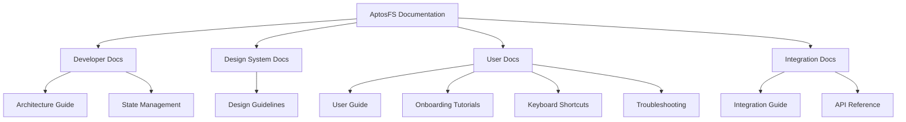

# AptosFS Documentation

Welcome to the comprehensive documentation for AptosFS, a decentralized file system built on the Aptos blockchain.

This documentation is organized into four main sections to serve different audiences: developers, designers, users, and integrators.

## Quick Links

### For Developers
- [Component Architecture Guide](./developer/architecture-guide.md) - Understand the system design and component relationships
- [State Management Patterns](./developer/state-management.md) - Learn about state flow and management techniques

### For Designers
- [Design Guidelines](./design-system/guidelines.md) - Design tokens, components, and patterns

### For Users
- [User Guide](./user/user-guide.md) - Comprehensive guide to using AptosFS
- [Onboarding Tutorials](./user/onboarding-tutorials.md) - Step-by-step guides for new users
- [Keyboard Shortcuts](./user/keyboard-shortcuts.md) - Reference for all keyboard shortcuts
- [Troubleshooting](./user/troubleshooting.md) - Solutions for common issues

### For Integrators
- [Integration Guide](./integration/integration-guide.md) - How to integrate with AptosFS
- [API Reference](./integration/api-reference.md) - Complete API documentation

## Documentation Overview



## Developer Documentation

Documentation targeted at developers working on or extending AptosFS.

### [Component Architecture Guide](./developer/architecture-guide.md)
- System overview and architecture principles
- Core components and their responsibilities
- Component hierarchy and relationships
- Data flow patterns
- Key design patterns used throughout the system
- Extension points for customization

### [State Management Patterns](./developer/state-management.md)
- Overview of state management approach
- Context providers and their responsibilities
- State flow patterns
- Optimizing re-renders
- State persistence strategies
- Error handling within state management

## Design System Documentation

Documentation for the AptosFS design system and UI components.

### [Design Guidelines](./design-system/guidelines.md)
- Design principles
- Color system
- Typography
- Spacing
- Component patterns
- Responsive design guidelines
- Accessibility standards
- Animation and motion guidelines

## User Documentation

Documentation for end users of AptosFS.

### [User Guide](./user/user-guide.md)
- Getting started
- Interface overview
- File management
- Sharing and collaboration
- Security and privacy
- Advanced features
- Mobile access
- Keyboard shortcuts reference

### [Onboarding Tutorials](./user/onboarding-tutorials.md)
- Creating your account
- Exploring the interface
- Uploading your first files
- Creating and organizing folders
- Downloading and sharing files
- Blockchain verification
- Using version history
- Collaborative editing
- Mobile access
- Integrating with other tools

### [Keyboard Shortcuts](./user/keyboard-shortcuts.md)
- Navigation shortcuts
- Selection shortcuts
- File operations shortcuts
- View shortcuts
- Search shortcuts
- Preview shortcuts
- Application shortcuts
- Accessibility shortcuts
- Blockchain integration shortcuts

### [Troubleshooting](./user/troubleshooting.md)
- Connection issues
- File upload problems
- File download problems
- Performance issues
- Account and authentication
- Blockchain integration
- Sharing and collaboration
- Mobile access
- Common error messages
- Getting additional help

## Integration Documentation

Documentation for developers integrating with AptosFS.

### [Integration Guide](./integration/integration-guide.md)
- Authentication methods
- REST API integration
- Storage provider integration
- Blockchain integration
- Webhooks and events
- Security best practices
- Rate limiting and quotas
- SDKs and libraries
- Integration examples

### [API Reference](./integration/api-reference.md)
- Complete API endpoints
- Request and response formats
- Authentication requirements
- Error handling
- File operations API
- Folder operations API
- Sharing API
- User API
- Webhook API
- Blockchain API

## In-App Help System

AptosFS includes a contextual help system integrated into the UI. Developers can find the implementation in:

```
src/components/help/HelpSystem.tsx
```

This component provides:
- Context-sensitive help based on user location
- Tooltips for UI elements
- Comprehensive help panels
- Related topics suggestions
- Keyboard shortcut references

## Contributing to Documentation

We welcome contributions to improve this documentation. Please follow these guidelines:

1. Use Markdown format for all documentation
2. Include code examples where appropriate
3. Use mermaid diagrams for visualizing concepts
4. Keep content up-to-date with the latest features
5. Follow the existing organization structure
6. Create pull requests for review

## Future Documentation Plans

Documentation we plan to add in future updates:

1. Component Storybook for visual reference
2. Video tutorials
3. Interactive code examples
4. API playground for testing endpoints
5. User feedback integration