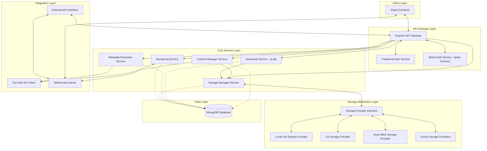

# YouTube Content Archiving System Architecture

## Overview

This document outlines the comprehensive architecture for a YouTube content archiving system designed to select, download, and preserve content from YouTube channels and playlists. The system provides real-time monitoring, customizable organization, and multiple storage options with both traditional and Web3 authentication methods.

## 1. System Architecture Diagram



## 2. Component Descriptions and Interactions

### Client Layer
- **React Frontend**: Single-page application providing user interface for:
  - User authentication and account management
  - Channel/playlist selection and download management
  - Archive browsing with customizable views
  - Download progress monitoring
  - System statistics and reports
  - Archive playback and content viewing

### API Gateway Layer
- **Express API Gateway**: Central entry point for all HTTP requests
  - Route requests to appropriate services
  - Handle request validation
  - Manage rate limiting for API protection
  - Apply caching strategies
  
- **Authentication Services**:
  - **Traditional Auth Service**:
    - JWT-based authentication
    - Session management
    - Role-based access control
  
  - **Web3 Auth Service - Aptos Connect**:
    - Integrate with Aptos blockchain
    - Support wallet-based authentication
    - Verify digital signatures
    - Map blockchain addresses to user accounts
    - Handle token-based authorization for Web3 users

### Core Service Layer
- **Content Manager Service**:
  - Channel and playlist discovery
  - Content selection and prioritization
  - Manage video metadata
  - Handle archiving requests
  
- **Download Service**:
  - Uses yt-dlp instead of YouTube API for downloads
  - Implements a command-line interface to yt-dlp
  - Manages yt-dlp configuration for optimal downloads
  - Provides job queue and management for download tasks
  - Handles download resumption and error recovery
  - Monitors download progress and status
  
- **Metadata Extraction Service**:
  - Extract video metadata from YouTube
  - Process and standardize metadata format
  - Extract thumbnails and supplementary content
  - Generate metadata indexes
  
- **Storage Manager Service**:
  - Interfaces with the Storage Abstraction Layer
  - Manages directory structure templates
  - Handles file organization policies
  - Implements file naming conventions
  - Tracks storage allocation across providers
  
- **Monitoring Service**:
  - Track system health metrics
  - Monitor download progress
  - Aggregate performance statistics
  - Generate alerts and notifications
  - Provide real-time status updates

### Integration Layer
- **YouTube API Client**:
  - Focused on metadata, playlist discovery, and API interactions
  - Manages API quotas and rate limiting
  - Retrieves video metadata and playlist information
  - Monitors channel updates and new content

- **WebSocket Server**:
  - Provide real-time updates to clients
  - Stream download progress
  - Broadcast system notifications
  - Enable live monitoring data

- **External API Interface**:
  - Expose RESTful APIs for third-party integration
  - Provide developer documentation
  - Implement API versioning
  - Support webhook notifications

### Storage Abstraction Layer
- **Storage Provider Interface**:
  - Defines a common API for all storage providers
  - Handles file operations (create, read, update, delete)
  - Provides streaming capabilities for video content
  - Manages permissions and access controls
  - Implements caching strategies

- **Local File System Provider**:
  - Implements Storage Provider Interface for local file systems
  - Handles file operations on the server's file system
  - Optimizes for local access patterns
  - Manages directory structure on the local disk

- **S3 Storage Provider**:
  - Implements Storage Provider Interface for S3-compatible storage
  - Maps file operations to S3 API calls
  - Handles S3 credentials and authentication
  - Optimizes for S3 access patterns (presigned URLs, etc.)
  - Manages S3 bucket structure and naming

- **Azure Blob Storage Provider**:
  - Implements Storage Provider Interface for Azure Blob Storage
  - Maps file operations to Azure Storage API calls
  - Handles Azure credentials and authentication
  - Optimizes for Azure Blob Storage access patterns
  - Manages container structure and naming

- **Future Storage Providers**:
  - Extensible architecture for adding new storage backends
  - Potential for Google Cloud Storage, IPFS, or other systems
  - Plugin architecture for community-developed providers

### Data Layer
- **MongoDB Database**:
  - Store user account information
  - Maintain channel and video metadata
  - Track download history and status
  - Store system configuration

## 3. Data Flow Explanations

### Authentication Flow (with Web3/Aptos Support)
1. User chooses authentication method (traditional or Web3/Aptos)
2. For Web3 authentication:
   a. Frontend requests message to sign
   b. User signs message with Aptos wallet
   c. Signature and wallet address sent to Web3 Auth Service
   d. Service verifies signature and issues JWT
3. For traditional authentication:
   a. Credentials sent to Traditional Auth Service
   b. Service validates and issues JWT
4. Frontend stores token and includes it in subsequent requests
5. API Gateway validates token for each protected endpoint

### Video Archiving Flow (with yt-dlp)
1. User selects channel/playlist for archiving via frontend
2. Request sent to API Gateway and routed to Content Manager
3. Content Manager queries YouTube API for content details
4. Metadata is stored in MongoDB for reference
5. Download jobs are created with yt-dlp configuration and queued
6. Download Service executes yt-dlp with appropriate parameters
7. yt-dlp handles download, format selection, and extraction
8. Download Service monitors yt-dlp progress and sends to Monitoring Service
9. WebSocket Server pushes real-time progress updates to frontend
10. Downloaded content is passed to Storage Manager
11. Storage Manager uses Provider Interface to save to configured storage
12. Metadata Extraction Service processes and enriches metadata
13. Provider Interface handles storage operations based on selected provider
14. Monitoring Service updates database with completion status

### Storage Operations Flow (with Abstraction Layer)
1. Storage Manager requests file operation through Provider Interface
2. Interface determines the appropriate provider based on configuration
3. Provider-specific implementation handles the operation
4. For reads, data is streamed through Provider Interface to requester
5. For writes, data is streamed from source through Interface to provider
6. Metadata about storage location is stored in MongoDB
7. Content URLs are generated based on provider and access method

### Real-time Monitoring Flow
1. Monitoring Service collects data from all services
2. Data is aggregated and processed for different views
3. WebSocket Server streams updates to connected clients
4. Frontend displays real-time progress bars, statistics, and alerts
5. External API clients can subscribe to status updates

### Third-party Integration Flow
1. External application authenticates with API
2. Application makes requests to External API Interface
3. API Gateway routes requests to appropriate internal services
4. Responses are formatted and returned through API Interface
5. WebSocket connections allow real-time updates for third parties

## 4. Technology Stack Recommendations

### Frontend
- **Framework**: React with TypeScript
- **State Management**: Redux or Context API
- **UI Framework**: Material-UI or Chakra UI
- **Real-time Updates**: Socket.IO client
- **HTTP Client**: Axios
- **Build Tool**: Vite or Create React App

### Backend
- **Runtime**: Node.js
- **API Framework**: Express.js
- **Authentication**: 
  - Passport.js with JWT strategy
  - Custom Web3/Aptos Connect integration
- **WebSockets**: Socket.IO
- **Video Processing**: 
  - yt-dlp (via Node child_process or dedicated wrapper)
  - ffmpeg for additional processing if needed
- **Job Queue**: Bull with Redis
- **Validation**: Joi or Zod
- **Logging**: Winston or Pino
- **API Documentation**: Swagger/OpenAPI
- **Storage Providers**: 
  - fs-extra for local storage
  - AWS SDK for S3
  - Azure Storage SDK for Azure Blob Storage

### Database
- **Primary Database**: MongoDB
- **ODM**: Mongoose
- **Caching**: Redis

### DevOps (for prototype)
- **Containerization**: Docker
- **Deployment**: Docker Compose
- **CI/CD**: GitHub Actions
- **Monitoring**: PM2 for the prototype stage

## 5. API Contract Specifications

### Authentication Endpoints
```
POST /api/auth/register
POST /api/auth/login
POST /api/auth/refresh
GET /api/auth/profile
PUT /api/auth/profile

# Web3/Aptos Authentication
GET /api/auth/web3/challenge
POST /api/auth/web3/verify
GET /api/auth/web3/profile
```

### Channel/Playlist Management
```
GET /api/channels/search?q={query}
GET /api/channels/{channelId}
GET /api/channels/{channelId}/playlists
GET /api/playlists/{playlistId}
GET /api/playlists/{playlistId}/videos
```

### Archive Management
```
POST /api/archives
GET /api/archives
GET /api/archives/{archiveId}
DELETE /api/archives/{archiveId}
PUT /api/archives/{archiveId}/settings
```

### Download Management
```
POST /api/downloads
GET /api/downloads
GET /api/downloads/{downloadId}
DELETE /api/downloads/{downloadId}
PUT /api/downloads/{downloadId}/pause
PUT /api/downloads/{downloadId}/resume
```

### Content Access
```
GET /api/content/{contentId}
GET /api/content/{contentId}/stream
GET /api/content/{contentId}/metadata
GET /api/content/{contentId}/thumbnail
```

### Storage Configuration
```
GET /api/storage/providers
GET /api/storage/providers/{providerId}
PUT /api/storage/providers/{providerId}/configure
POST /api/storage/providers/switch
GET /api/storage/stats
```

### System Monitoring
```
GET /api/stats/system
GET /api/stats/downloads
GET /api/stats/storage
GET /api/logs?level={level}
```

### WebSocket Events
```
connection: Initial connection
download:started: Download job started
download:progress: Real-time progress update
download:completed: Download job completed
download:error: Download job error
system:alert: System alert notification
```

### External API (for Developers)
```
POST /api/external/hook
GET /api/external/status
POST /api/external/trigger
```

## 6. Storage Structure and Organization Strategy

### Storage Abstraction
The system will implement a storage abstraction layer with these key interfaces:

```typescript
interface StorageProvider {
  // Core file operations
  writeFile(path: string, data: Buffer | Stream): Promise<void>;
  readFile(path: string): Promise<Buffer>;
  createReadStream(path: string): ReadableStream;
  createWriteStream(path: string): WritableStream;
  deleteFile(path: string): Promise<void>;
  fileExists(path: string): Promise<boolean>;
  
  // Directory operations
  createDirectory(path: string): Promise<void>;
  listDirectory(path: string): Promise<string[]>;
  deleteDirectory(path: string, recursive: boolean): Promise<void>;
  
  // Metadata operations
  getMetadata(path: string): Promise<FileMetadata>;
  updateMetadata(path: string, metadata: Partial<FileMetadata>): Promise<void>;
  
  // URL generation
  getPublicUrl(path: string, options?: UrlOptions): Promise<string>;
  getSignedUrl(path: string, expiry: number): Promise<string>;
}
```

### Provider-Specific Implementations
Each storage provider will implement the interface above with provider-specific logic:

1. **Local File System Provider**:
   - Uses Node.js fs module with extensions
   - Handles paths relative to configured base directory
   - Generates URLs for local network access

2. **S3 Storage Provider**:
   - Maps operations to S3 SDK methods
   - Handles S3 bucket and key management
   - Generates presigned URLs for content access

3. **Azure Blob Storage Provider**:
   - Maps operations to Azure Storage SDK methods
   - Handles container and blob management
   - Generates SAS tokens for access control

### Directory Structure
The system will use a customizable directory structure through templates. Default structure:

```
/archive
  /{channelId}-{channelName}/
    /metadata.json
    /channel-thumbnail.jpg
    /{playlistId}-{playlistName}/
      /metadata.json
      /playlist-thumbnail.jpg
      /{videoId}-{uploadDate}-{videoTitle}/
        /video.mp4
        /metadata.json
        /thumbnail.jpg
        /description.txt
        /comments.json (if enabled)
        /subtitles/
          /{language}.vtt
```

### Metadata Storage
Each content level will have a corresponding metadata.json file containing:

1. **Channel Metadata**:
   - Channel ID, name, description
   - Subscriber count, video count
   - Creation date, last updated

2. **Playlist Metadata**:
   - Playlist ID, name, description
   - Video count, creation date
   - Last updated, visibility settings

3. **Video Metadata**:
   - Video ID, title, description
   - Upload date, duration, tags
   - View count, like count, comment count
   - Quality information
   - Additional YouTube-specific metadata

### Database Collections
The MongoDB database will include these primary collections:

1. **Users**
   - Authentication details
   - Preferences and settings
   - Role and permissions

2. **Channels**
   - Channel metadata
   - Archive status
   - Last checked timestamp

3. **Playlists**
   - Playlist metadata
   - Parent channel reference
   - Archive status

4. **Videos**
   - Video metadata
   - Parent playlist reference
   - Archive status
   - File references

5. **Downloads**
   - Queue information
   - Progress tracking
   - Error history
   - Retry attempts

6. **Logs**
   - System logs
   - Error information
   - User activity logs
   - API access logs

## 7. Web3 Authentication Implementation Details

### Aptos Connect Integration
1. **Challenge Generation**:
   - Server generates random challenge message
   - Challenge is stored temporarily with session identifier
   - Challenge is returned to client

2. **Signature Verification**:
   - Client signs challenge with Aptos wallet
   - Signature, wallet address, and session identifier sent to server
   - Server verifies signature against stored challenge
   - Upon verification, server creates user account if needed
   - JWT token issued containing user information and wallet address

3. **User Account Mapping**:
   - Wallet addresses mapped to user accounts in database
   - First-time Web3 users create accounts automatically
   - Traditional accounts can link to Web3 wallets

4. **Authorization**:
   - Role-based permissions can be assigned based on wallet properties
   - Special NFT-based access control can be implemented
   - JWT tokens include both traditional and Web3 claims

## 8. System Security Considerations

- JWT-based authentication with short expiration times
- HTTPS for all connections
- Rate limiting for API endpoints
- Input validation for all user inputs
- Principle of least privilege for internal services
- Sanitization of file names and paths
- Regular security audits (for production)

## 9. Error Handling and Reliability

- Comprehensive error logging using Winston
- Automated retry mechanism for failed downloads
- Circuit breaking for external API calls
- Graceful degradation for non-critical components
- Resume capability for interrupted downloads
- Transaction support for critical operations
- Regular health checks for all services